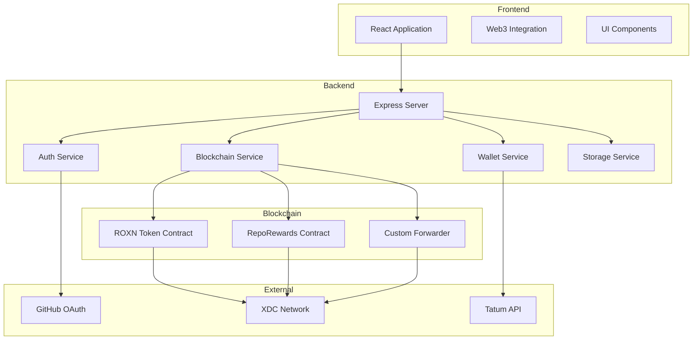

# Roxonn with XDC Blockchain Integration

A decentralized platform for managing GitHub repository contributions using XDC blockchain technology. This system enables secure identity management, reward distribution, and contribution tracking for open-source projects using the ROXN token.

## Architecture Overview



## Implementation Details

### 1. Smart Contract Architecture
- **ROXNToken Contract**: ERC20/XRC20 token with role-based access control
  - Features pausable, burnable functionality
  - Implements maximum supply cap of 1 billion tokens
- **RepoRewards Contract**: Manages repository rewards and contribution tracking
  - Pool Managers: Can allocate rewards and manage repositories
  - Contributors: Can receive rewards for contributions
  - Uses a gas-efficient design with optimized storage
- **CustomForwarder Contract**: Meta-transaction implementation
  - Enables gas-less transactions for better user experience
  - Implements EIP-712 signature verification

### 2. User Registration Flow
1. User authenticates via GitHub OAuth
2. System generates XDC wallet using Tatum API
3. Relayer wallet registers user on blockchain
4. User wallet details stored securely in database

### 3. Transaction Management
- **Relayer Wallet**: 
  - Handles user registration transactions
  - Manages gas fees for onboarding
  - Uses dynamic gas pricing with network monitoring
- **User Wallet**:
  - Manages personal transactions (allocating funds, etc.)
  - Requires user signature for operations
  - Full control over funds and rewards

### 4. Security Features
- Secure wallet generation and storage
- Protected API endpoints
- Relayer wallet with limited permissions
- Transaction signing validation
- Gas price management for network stability
- AWS KMS integration for key management

## Extended Functionality

The platform includes detailed specifications for:

1. **Token System**: Comprehensive ROXN token implementation ([details](docs/TOKEN_SPECIFICATION.md))
2. **Staking Mechanisms**: Multi-tiered staking with governance benefits ([details](docs/STAKING_IMPLEMENTATION.md))
3. **Governance Framework**: On-chain governance with proposal system ([details](docs/GOVERNANCE_SPECIFICATION.md))
4. **Anti-Gaming Protection**: Mechanisms to prevent reward system abuse ([details](docs/ANTI_GAMING_SYSTEM.md))
5. **Contract Upgradeability**: UUPS proxy pattern implementation ([details](docs/ROXN_CONTRACT_IMPLEMENTATION.md))
6. **Migration Strategy**: Token and system migration guidelines ([details](docs/MIGRATION_GUIDE.md))

## Technology Stack
- Frontend: React, TypeScript, Web3.js, Tailwind CSS
- Backend: Express, TypeScript, PostgreSQL, Drizzle ORM
- Blockchain: XDC Network (Apothem Testnet)
- Smart Contracts: Solidity, OpenZeppelin
- Wallet Management: Tatum API, AWS KMS
- Deployment: Docker, Nginx

## Getting Started

1. Clone the repository
2. Install dependencies: `npm install`
3. Set up environment variables (see `.env.example`)
4. Run the development server: `npm run dev`

### Development Environment
```
# Backend
npm run dev:server

# Frontend
npm run dev:client

# Smart Contracts
npx hardhat compile
npx hardhat test
```

## Contributing
Contributions are welcome! Please read our contributing guidelines for details.

## License
This project is licensed under the MIT License.

## Partner Integration APIs

### User Registration Verification

This API allows partner platforms (like Rewards Bunny) to verify if a user has successfully registered on Roxonn.

**Endpoint:** `GET /api/partners/verify-registration`

**Query Parameters:**
- `apiKey` (required): Your partner API key
- `username` OR `githubId` (at least one required): Identifies the user to verify
  - `username`: The user's GitHub username
  - `githubId`: The user's GitHub ID

**Responses:**

- **Success (200):**
  ```json
  {
    "success": true,
    "verified": true,
    "message": "User is registered",
    "timestamp": "2023-06-08T12:34:56.789Z",
    "user": {
      "username": "johndoe",
      "githubId": "12345678",
      "registrationDate": "2023-06-01T10:20:30.456Z",
      "hasWallet": true
    }
  }
  ```

- **User exists but not fully registered (200):**
  ```json
  {
    "success": true,
    "verified": false,
    "message": "User exists but has not completed registration",
    "timestamp": "2023-06-08T12:34:56.789Z",
    "user": null
  }
  ```

- **User not found (404):**
  ```json
  {
    "success": false,
    "verified": false,
    "message": "User not found",
    "timestamp": "2023-06-08T12:34:56.789Z"
  }
  ```

- **Unauthorized (401):**
  ```json
  {
    "success": false,
    "error": "Unauthorized - Invalid or missing API key"
  }
  ```

- **Bad request (400):**
  ```json
  {
    "success": false,
    "error": "At least one user identifier (username or githubId) is required"
  }
  ```

**Integration Example:**

```javascript
// Sample Node.js code to verify a user
const axios = require('axios');

async function verifyUserRegistration(username) {
  try {
    const response = await axios.get('https://api.roxonn.com/api/partners/verify-registration', {
      params: {
        username: username,
        apiKey: 'your_partner_api_key'
      }
    });
    
    if (response.data.verified) {
      console.log('User has successfully registered on Roxonn!');
      return true;
    } else {
      console.log('User exists but has not completed registration');
      return false;
    }
  } catch (error) {
    console.error('Error verifying user:', error.response?.data || error.message);
    return false;
  }
}
```

### Security Considerations

- The partner API key should be kept confidential and never exposed in client-side code
- All requests should be made server-to-server
- We recommend implementing rate limiting on your side to prevent abuse
- For security and privacy reasons, only minimal user information is returned
