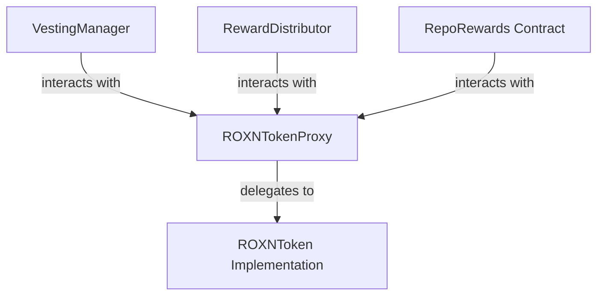

# ROXN Token Specification
**Version**: 1.0.0  
**Date**: 2023-10-15  
**Status**: Draft  

## Table of Contents
- [1. Overview](#1-overview)
  - [1.1 Purpose](#11-purpose)
  - [1.2 Token Summary](#12-token-summary)
- [2. Technical Specifications](#2-technical-specifications)
  - [2.1 Token Standard](#21-token-standard)
  - [2.2 Core Parameters](#22-core-parameters)
  - [2.3 Contract Features](#23-contract-features)
- [3. Token Economics](#3-token-economics)
  - [3.1 Supply Allocation](#31-supply-allocation)
  - [3.2 Vesting Schedule](#32-vesting-schedule)
  - [3.3 Emissions Strategy](#33-emissions-strategy)
- [4. Smart Contract Architecture](#4-smart-contract-architecture)
  - [4.1 Contract Structure](#41-contract-structure)
  - [4.2 Access Control](#42-access-control)
  - [4.3 Upgradeability](#43-upgradeability)
- [5. Integration with Roxonn](#5-integration-with-roxonn)
  - [5.1 Migration from XDC Native Token](#51-migration-from-xdc-native-token)
  - [5.2 Repository Rewards Integration](#52-repository-rewards-integration)
  - [5.3 Transaction Flow](#53-transaction-flow)
- [6. Security Considerations](#6-security-considerations)
  - [6.1 Access Control](#61-access-control)
  - [6.2 Audit Requirements](#62-audit-requirements)
  - [6.3 Known Issues and Mitigations](#63-known-issues-and-mitigations)
- [7. Deployment Process](#7-deployment-process)
  - [7.1 Deployment Steps](#71-deployment-steps)
  - [7.2 Verification](#72-verification)
  - [7.3 Post-Deployment Tasks](#73-post-deployment-tasks)
- [8. Testing Requirements](#8-testing-requirements)
  - [8.1 Unit Tests](#81-unit-tests)
  - [8.2 Integration Tests](#82-integration-tests)
  - [8.3 Security Tests](#83-security-tests)
- [9. References](#9-references)

## 1. Overview

### 1.1 Purpose
The ROXN token is designed to power the Roxonn platform, enabling reward distribution for open-source contributors. This document specifies the technical implementation details, token economics, and integration approach for the ROXN token.

### 1.2 Token Summary
| Parameter | Description |
|-----------|-------------|
| Name | Roxonn Token |
| Symbol | ROXN |
| Decimals | 18 |
| Total Supply | 1,000,000,000 (1 billion) ROXN |
| Blockchain | XDC Network |
| Standard | XRC20 (ERC-20 compatible) |
| Contract Type | Upgradeable (UUPS Proxy Pattern) |

## 2. Technical Specifications

### 2.1 Token Standard
The ROXN token implements the XRC20 token standard (equivalent to ERC-20 on Ethereum) on the XDC Network. The implementation follows the OpenZeppelin ERC20 implementation with additional extensions.

### 2.2 Core Parameters
- **Name**: "Roxonn Token"
- **Symbol**: "ROXN"
- **Decimals**: 18
- **Initial Supply**: 1,000,000,000 ROXN (1 billion)
- **Maximum Supply**: 1,000,000,000 ROXN (fixed cap)

### 2.3 Contract Features
The token contract includes the following features:
- **Standard ERC-20 Functionality**: Transfer, balanceOf, approve, transferFrom, etc.
- **Mintable**: Controlled token minting by authorized addresses
- **Burnable**: Users can burn their own tokens, and authorized addresses can burn from specific accounts
- **Pausable**: Ability to pause all token transfers in emergency situations
- **Upgradeable**: Uses UUPS proxy pattern for future upgrades
- **Access Control**: Role-based access control for various functions
- **Events**: Standard and custom events for all significant state changes

## 3. Token Economics

### 3.1 Supply Allocation
| Category | Allocation (%) | Amount (ROXN) | Description |
|----------|----------------|--------------|-------------|
| Reward Pool (Contributors) | 40% | 400,000,000 | For rewarding open-source contributors |
| Liquidity & Staking Incentives | 20% | 200,000,000 | For DEX liquidity and staking rewards |
| Team & Advisors | 15% | 150,000,000 | For founding team, employees, and advisors |
| Marketing & Growth | 10% | 100,000,000 | For marketing, partnerships, and user acquisition |
| Early Investors & Partnerships | 10% | 100,000,000 | For early investors and strategic partners |
| Reserve Fund | 5% | 50,000,000 | For future contingencies and development |

### 3.2 Vesting Schedule
| Category | Cliff Period | Vesting Duration | Unlock Schedule |
|----------|--------------|------------------|----------------|
| Team & Core Contributors | 12 months | 48 months | 25% annually after cliff |
| Advisors & Partners | 6 months | 24 months | 50% annually after cliff |
| Early Investors | 6 months | 18 months | 33% every 6 months after cliff |
| Reward Pool | None | 60 months | Linear emission over 5 years |

### 3.3 Emissions Strategy
The contributor reward pool (40% of total supply) will be released gradually over time:
- **Initial Release**: 20% of reward pool (80M ROXN) available at launch
- **Continuous Emission**: Remaining 80% (320M ROXN) released linearly over 60 months
- **Emission Rate**: Approximately 5.33M ROXN per month
- **Adjustment Mechanism**: Emission rate may be adjusted through governance votes

## 4. Smart Contract Architecture

### 4.1 Contract Structure
The ROXN token implementation consists of the following contracts:
- **ROXNToken.sol**: Main token implementation
- **ROXNTokenProxy.sol**: UUPS proxy for upgradeability
- **VestingManager.sol**: Manages vesting schedules for different allocations
- **RewardDistributor.sol**: Handles contributor reward distribution

### 4.2 Access Control
The token implements role-based access control with the following roles:
- **DEFAULT_ADMIN_ROLE**: Can grant/revoke other roles
- **UPGRADER_ROLE**: Can upgrade the contract implementation
- **PAUSER_ROLE**: Can pause/unpause token transfers
- **MINTER_ROLE**: Can mint new tokens (within allocation limits)
- **BURNER_ROLE**: Can burn tokens from specific addresses

### 4.3 Upgradeability
The token uses the UUPS (Universal Upgradeable Proxy Standard) pattern:
- **Proxy Contract**: Handles delegation and storage
- **Implementation Contract**: Contains the logic
- **Upgrade Process**: Requires UPGRADER_ROLE authorization
- **Storage Layout**: Strictly versioned to prevent collisions

## 5. Integration with Roxonn

### 5.1 Migration from XDC Native Token
The migration from XDC native token to ROXN token involves:
1. Deploying the ROXN token contracts
2. Updating the RepoRewards contract to work with ROXN
3. Migrating existing pool balances to ROXN tokens
4. Updating frontend components to display ROXN balances and operations

### 5.2 Repository Rewards Integration
The RepoRewards contract will be modified to:
- Accept ROXN tokens instead of native XDC
- Require token approvals before adding funds to repositories
- Transfer ROXN tokens for rewards instead of native XDC
- Track token balances properly

### 5.3 Transaction Flow
For adding funds to a repository:
1. User approves ROXN tokens to be spent by the RepoRewards contract
2. User calls `addFundToRepository` with the repository ID
3. RepoRewards contract transfers ROXN tokens from user to itself
4. Repository's token balance is updated

For distributing rewards:
1. Pool manager calls `distributeReward` with repository ID, issue ID, and contributor address
2. RepoRewards contract transfers ROXN tokens to the contributor
3. Issue reward record is updated

## 6. Security Considerations

### 6.1 Access Control
- All sensitive functions require appropriate role authorization
- Multi-signature wallets will be used for all admin roles
- Timelock delays implemented for critical operations

### 6.2 Audit Requirements
- Full smart contract audit by a reputable security firm
- Specific audit focus on token economics and integration
- Audit results must be addressed before mainnet deployment

### 6.3 Known Issues and Mitigations
- **Front-running**: Mitigated through access controls and approve/transferFrom pattern
- **Reentrancy**: Prevented using checks-effects-interactions pattern and reentrancy guards
- **Integer Overflow/Underflow**: Using SafeMath or Solidity 0.8.x built-in overflow checks
- **Centralization Risks**: Mitigated through multi-sig wallets and tiered access control

## 7. Deployment Process

### 7.1 Deployment Steps
1. Deploy implementation contract
2. Deploy and initialize proxy with implementation address
3. Set up roles and initial parameters
4. Mint initial token allocations
5. Set up vesting schedules
6. Deploy reward distributor
7. Update RepoRewards contract
8. Verify all contracts on XDCScan

### 7.2 Verification
- Verify contract source code on XDCScan
- Verify token parameters (name, symbol, decimals, total supply)
- Verify role assignments
- Verify token allocations

### 7.3 Post-Deployment Tasks
- Set up liquidity on XSwap
- Transfer team and investor allocations to vesting contracts
- Initialize reward distribution mechanism
- Update frontend to support ROXN token

## 8. Testing Requirements

### 8.1 Unit Tests
- Token basic functionality (transfer, approve, etc.)
- Role-based access control
- Minting and burning mechanisms
- Pause functionality
- Upgrade mechanism

### 8.2 Integration Tests
- RepoRewards contract integration
- Vesting schedule functionality
- Reward distribution
- Frontend integration

### 8.3 Security Tests
- Access control checks
- Pausability during emergencies
- Upgrade security
- Economic attack scenarios

## 9. References
- [OpenZeppelin ERC20 Implementation](https://docs.openzeppelin.com/contracts/4.x/erc20)
- [UUPS Proxy Pattern](https://docs.openzeppelin.com/contracts/4.x/api/proxy#UUPSUpgradeable)
- [XDC Network Documentation](https://docs.xdc.community/)
- [Roxonn Architecture](https://github.com/Roxonn-FutureTech/GitHubIdentity) 