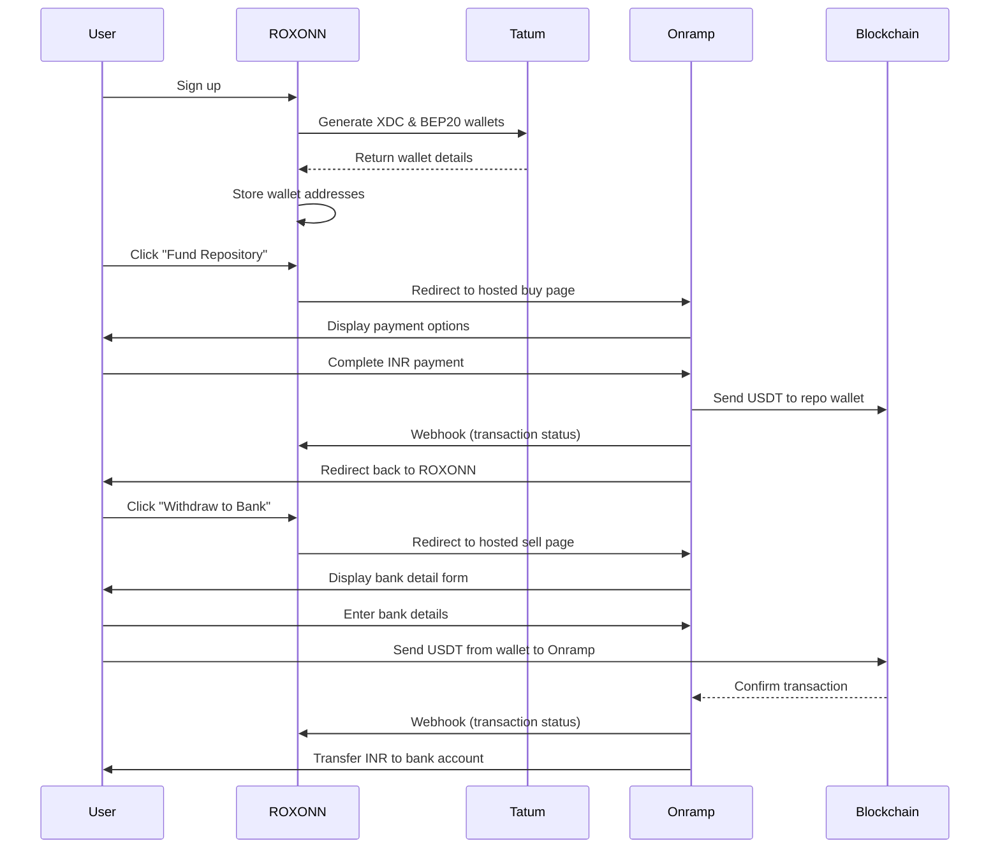

# ROXONN Tatum & Onramp Integration Plan

*Last updated: 2025-05-22*

This document serves as the definitive guide for integrating Tatum's multi-chain wallet capabilities and Onramp's fiat on/off-ramp solution into the ROXONN GitHubIdentity platform.

## Table of Contents
1. [Executive Summary](#executive-summary)
2. [Current Architecture](#current-architecture)
3. [Target Architecture](#target-architecture)
4. [Implementation Plan](#implementation-plan)
5. [Technical Specifications](#technical-specifications)
6. [Testing Strategy](#testing-strategy)
7. [Timeline & Milestones](#timeline--milestones)
8. [Future Considerations](#future-considerations)

## Executive Summary

ROXONN's GitHubIdentity platform currently uses native XDC for repository funding and contributor rewards. This integration plan introduces:

1. **Multi-chain wallet support** using Tatum's wallet generation services
2. **Fiat on-ramp** allowing pool managers to fund repositories with INR→USDT
3. **Fiat off-ramp** enabling contributors to withdraw earnings directly to bank accounts

The implementation will maintain the existing XDC flow while adding USDT-BEP20 as an alternative currency option, starting with Tatum's free tier and Onramp's hosted mode solution.

## Current Architecture

### User Wallet Flow
- Single XDC wallet created during signup
- Wallet data stored in `users` table with `xdcWalletAddress` and `walletReferenceId`
- Balances fetched live from blockchain, not stored in DB
- Private keys managed securely via KMS

### Pool Manager Flow
- Fund repositories with native XDC
- Allocate bounties to specific issues
- Pay gas fees for smart contract interactions
- Funds locked in RepoRewards smart contract until distributed

### Contributor Flow
- Receive XDC rewards directly to wallet when PR is merged
- Currently no built-in fiat off-ramp
- Must manually handle any withdrawal/exchange to fiat

### Key Components
- Smart contract: `RepoRewards.sol` (XDC network)
- Backend services: `blockchain.ts`, `storage.ts`, `routes.ts`
- Database tables: `users`, `registeredRepositories`

## Target Architecture

### Multi-Chain Wallet System
- Users will have both XDC and BEP20 (Binance Smart Chain) wallets
- Both wallet addresses stored and managed in the user record
- Live balance checking for both networks
- Existing XDC smart contract untouched for backward compatibility

### Fiat On-Ramp (Pool Manager)
- Onramp hosted mode integration for INR→USDT purchases
- Redirect flow with return URL handling
- Webhook processing for transaction status updates
- USDT-BEP20 as the primary stable coin

### Fiat Off-Ramp (Contributor)
- "Withdraw to Bank" option on contributor dashboard
- Redirect to Onramp hosted sell page
- Pre-filled contributor wallet address
- User-initiated transfers (contributor pays gas)
- Webhook monitoring for completion status

### Flow Diagram



## Implementation Plan

### Phase 1: Tatum Multi-Chain Wallet Integration

1. **Setup & Configuration**
   - Register for Tatum free tier (or use existing account)
   - Configure environment variables
   - Create wallet management utilities

2. **Schema Updates**
   ```sql
   ALTER TABLE users ADD COLUMN bep20_wallet_address TEXT;
   ALTER TABLE users ADD COLUMN bep20_wallet_xpub TEXT;
   ALTER TABLE users ADD COLUMN bep20_wallet_ref TEXT;
   ```

3. **Wallet Service Implementation**
   - Create `server/wallet.ts` with core functions:
     - `generateWallets(userId)`: Creates both XDC and BEP20 wallets
     - `getUsdtBep20Balance(address)`: Fetches USDT balance on BSC
     - `sendUsdtBep20(from, to, amount)`: Transfers USDT on BSC

4. **User Registration Flow Update**
   - Extend signup process to generate both wallet types
   - Update profile page to display both wallet addresses

### Phase 2: Onramp Hosted Mode Integration (Buy Flow)

1. **Configuration**
   - Set up Onramp account (completed)
   - Configure webhook endpoints

2. **Frontend Components**
   - Create `OnrampButton.tsx` component that generates hosted mode URL
   - Update repository dashboard with new funding option

3. **Backend Services**
   - Implement return URL handler for redirects from Onramp
   - Create webhook processor for deposit confirmations
   - Add transaction tracking in database

4. **URL Structure**
   ```
   https://onramp.money/main/buy/?appId={YOUR_APP_ID}&walletAddress={bep20_address}&defaultCrypto=USDT&network=BEP20&defaultFiat=INR&redirectUrl=https://app.roxonn.com/onramp/return
   ```

### Phase 3: Onramp Off-Ramp Integration (Sell Flow)

1. **Frontend Components**
   - Create `WithdrawButton.tsx` component for contributor withdrawals
   - Update contributor dashboard with withdrawal option

2. **Backend Services**
   - Implement off-ramp return URL handler
   - Extend webhook processor to handle sell flow events
   - Add transaction status tracking

3. **URL Structure**
   ```
   https://onramp.money/main/sell/?appId={YOUR_APP_ID}&walletAddress={contributor_bep20_address}&defaultCrypto=USDT&network=BEP20&defaultFiat=INR&redirectUrl=https://app.roxonn.com/offramp/return
   ```

## Technical Specifications

### Environment Variables
```
# Tatum Configuration
TATUM_API_KEY=
POLYGON_RPC_URL=
USDT_BEP20_CONTRACT=0x55d398326f99059fF775485246999027B3197955

# Onramp Configuration
ONRAMP_APP_ID=your_app_id
ONRAMP_API_KEY=your_api_key
ONRAMP_APP_SECRET=your_app_secret
ONRAMP_WEBHOOK_SECRET=your_webhook_secret
```

### New Backend Modules

| Module | Purpose | Key Functions |
|--------|---------|--------------|
| `server/wallet.ts` | Tatum wallet operations | `generateWallets()`, `getBalance()`, `sendTokens()` |
| `server/routes/onramp.ts` | Handle redirects | `handleBuyReturn()`, `handleSellReturn()` |
| `server/webhooks/onramp.ts` | Process webhooks | `processDepositWebhook()`, `processWithdrawalWebhook()` |

### Frontend Components

| Component | Purpose | Key Props |
|-----------|---------|-----------|
| `OnrampButton.tsx` | Trigger buy flow | `amount`, `walletAddress`, `onSuccess` |
| `WithdrawButton.tsx` | Trigger sell flow | `amount`, `walletAddress`, `onSuccess` |

### Database Schema Updates

1. **Users Table**:
   - Add BEP20 wallet fields

2. **New Transaction Table**:
   ```sql
   CREATE TABLE onramp_transactions (
     id SERIAL PRIMARY KEY,
     user_id INTEGER REFERENCES users(id),
     repo_id INTEGER REFERENCES registered_repositories(id),
     type VARCHAR(10) NOT NULL, -- 'buy' or 'sell'
     amount NUMERIC NOT NULL,
     currency VARCHAR(10) NOT NULL,
     status VARCHAR(20) NOT NULL,
     order_id VARCHAR(50),
     created_at TIMESTAMP DEFAULT NOW(),
     updated_at TIMESTAMP DEFAULT NOW()
   );
   ```

## Testing Strategy

### Test Environment Setup
- Tatum testnet configuration
- Onramp sandbox mode (`?sandbox=true` parameter)
- Test wallets with pre-funded balances

### Unit Testing
- Wallet creation and balance checking
- URL generation for hosted mode
- Webhook signature verification

### Integration Testing
1. **User Registration Flow**
   - Verify both XDC and BEP20 wallets created
   - Confirm wallet references stored correctly

2. **On-Ramp Flow**
   - Test hosted mode redirect
   - Verify webhook processing
   - Confirm balance updates

3. **Off-Ramp Flow**
   - Test withdrawal initiation
   - Verify status updates via webhooks
   - Confirm transaction completion

### End-to-End Testing
- Complete user journey from signup to funding to withdrawal
- Edge cases: network errors, insufficient balances, failed transactions

## Timeline & Milestones

| Phase | Milestone | Timeline | Dependencies |
|-------|-----------|----------|--------------|
| 1 | Tatum wallet integration | Week 1 | None |
| 2 | Onramp buy flow (pool manager) | Week 2 | Phase 1 |
| 3 | Onramp sell flow (contributor) | Week 3 | Phase 2 |
| 4 | Testing & refinement | Week 4 | Phases 1-3 |
| 5 | Production deployment | Week 5 | Successful testing |

## Future Considerations

1. **Tatum Paid Tier Upgrade**
   - If transaction volume increases significantly
   - Enables Virtual Accounts for improved balance management
   - Higher webhook quota (200,000 vs. 100 per month)

2. **Additional Currencies**
   - Expand beyond USDT-BEP20 to other stablecoins
   - Support additional fiat currencies beyond INR

3. **Smart Contract Enhancement**
   - Consider refactoring RepoRewards.sol to support ERC20 tokens directly
   - Would enable fully on-chain tracking of USDT rewards

4. **Advanced Features**
   - Batch payouts for contributors
   - Automated gas management
   - Enhanced transaction reporting

---

*Document prepared by ROXONN Engineering Team*
